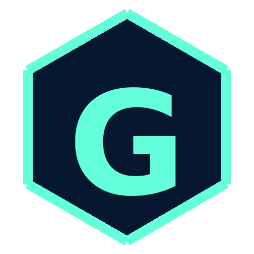

<div align="center">
  
</div>
<h1 align="center">gurudatta-patil.github.io</h1>
<p align="center">
  Personal site & portfolio for Gurudatta Patil — software engineer building AI-first products, realtime infrastructure, and thoughtful developer experiences.
</p>


## 📌 Overview

- **Stack:** Gatsby 3, React 17, Styled Components, and Markdown-powered content collections.
- **Focus:** Highlight AI-powered work (HP Inc., Razorpay, Fragments, TomTom) and UW–Madison research.
- **Design:** Driven by a bold teal-on-navy "G" logomark included in this repo.

This iteration is heavily customized for my story but still follows the structure of Brittany Chiang's legendary v4 release. If you reuse anything, keep attribution for both of us. 😊

## 🛠 Getting Started

1. **Install the Gatsby CLI**
   ```sh
   npm install -g gatsby-cli
   ```
2. **Match the Node version** (NVM keeps things easy):
   ```sh
   nvm install
   nvm use
   ```
3. **Install dependencies**
   ```sh
   npm install
   ```
4. **Start a local dev server**
   ```sh
   npm start
   ```

## 🚀 Production Workflow

| Step | Command |
| ---- | ------- |
| Build static assets | `npm run build` |
| Preview production bundle locally | `npm run serve` |

Deploy anywhere that can host static files (Netlify, Vercel, GitHub Pages, Cloudflare Pages, etc.).

## 🎨 Brand Colors

| Token | Hex |
| ----- | --- |
| Dark Navy | `#05182f` |
| Navy | `#0a192f` |
| Slate | `#8892b0` |
| Mint (Accent) | `#64ffda` |
| Sand | `#e6f1ff` |

## 🙏 Credits

- Design & build: **Gurudatta Patil** — [LinkedIn](https://www.linkedin.com/in/gurudatta-patil/) · [GitHub](https://github.com/gurudatta-patil)
- Starter inspiration: **Brittany Chiang** ([brittanychiang.com](https://brittanychiang.com)). None of this would exist without her open-source work.

Feel free to fork, remix, or learn from the code. Please leave attribution in place so folks know where the foundation began.
